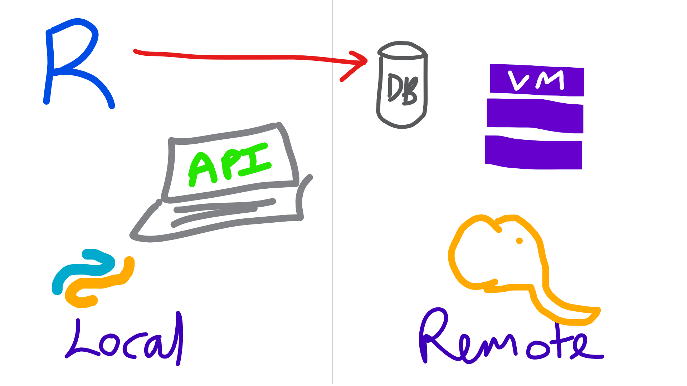
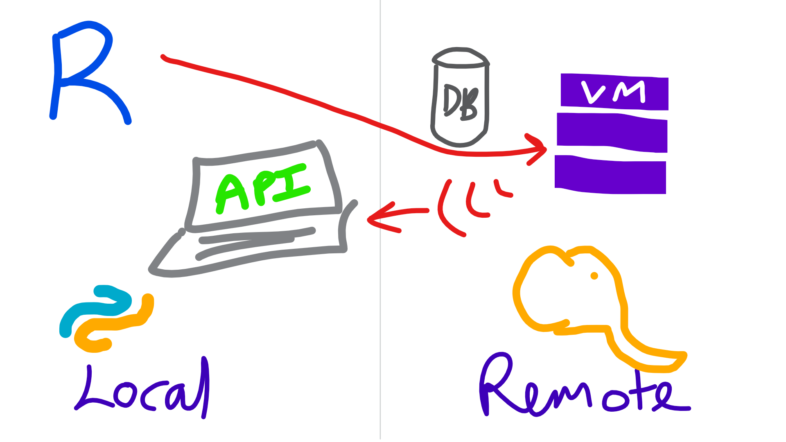
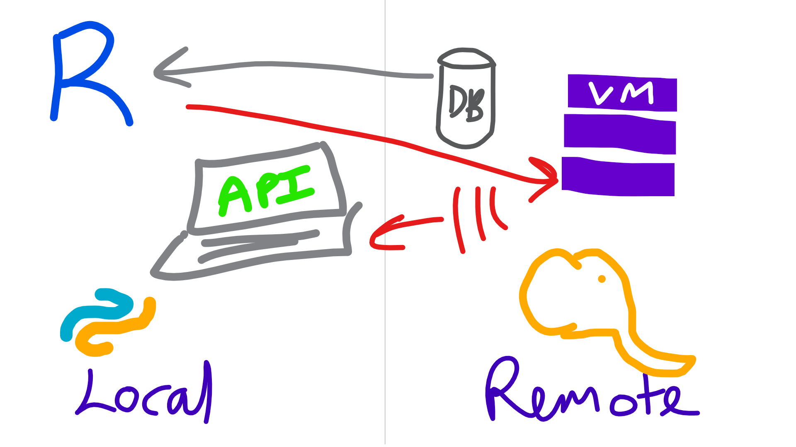
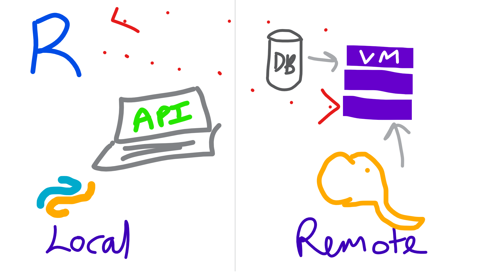

```{r setup, include=FALSE}
knitr::opts_chunk$set(echo = TRUE, tidy=FALSE, size="large", tidy.opts=list( width.cutoff=60))

do_eval<-TRUE
dbConn<-NULL
```

```{r autodoc, child='AboutMeBusiness.Rmd', eval=TRUE}
```

# ML Server

## Overview
- Runs R and Python
- Has special sauce packages
- Allows for remote computations
- Works on Windows and Linux

## Names
- Revolution R (<2016)
- Microsoft R Server (<2017)
- Microsoft ML Server (2017-?)

## What's new
- [ML Server supports Python](https://docs.microsoft.com/en-us/machine-learning-server/whats-new-in-machine-learning-server)
- [Extra algorithms and faster variants](https://docs.microsoft.com/en-us/machine-learning-server/whats-new-in-r-server)

## Editions
- Machine Learning Server for Hadoop	
    + Cloudera, Hortonworks, MapR supported
    + Can install on vanilla Hadoop
You can install Machine Learning Server on open source Apache Hadoop from http://hadoop.apache.org but we can only offer support for commercial distributions.
   + Works with Spark
- Machine Learning Server for Linux
- Machine Learning Server for Windows
    + Installs on desktop OS and server OS (not nano)

## SQL Server 2016/2017 Editions
- Express (w/ Advanced tools) - R Open or base R
- Standard - R Open or base R
- Enterprise - ML Server

[SQL Server feature comparison](https://docs.microsoft.com/en-us/sql/sql-server/editions-and-components-of-sql-server-2017#Programmability)

> Oo, and Azure SQL now!

## High-level reasons to use it
- Less data & compute on devices
- Hefty compute requirements
- Process out-of-memory stuff
- Fast algorithms
- Centrally administered environment
- Microsoft support agreement

# ML integrated with SQL
## SQL Server Overview
- Use `sp_execute_external_script` to call R from SQL
- Store model objects in SQL Server
- Use certain models in a native PREDICT function

# Typical workflows

## Local with R
1. Collect data with RODBC or something
2. Clean up data
3. Build model
4. Make model useful later
   + Save model object to disk
   + Save model in DB


## Local with R
```{r}

```

## Local with Microsoft R Client
1. Work with xdf or table connections
2. Clean up data with `dplyrXdf`
3. Build model using an rx* function
4. Make model useful later
   + Save model object to disk using `rxSerializeModel`
   + Make into an API using `mrsdeploy`
   + Save model in DB
   

## Local with Microsoft R Client
```{r}

```

## Semi-local
1. Connect to data using RevoScaleR
2. Clean up data with `rx*` functions
3. Build model using an `rx*` function
4. Make model useful later
   + Save model object to disk using `rxSerializeModel`
   + Make into an API using `mrsdeploy`

## Local with Microsoft R Client
```{r}

```


## Remote
1. Write code
1. Run locally on a sample
2. Send code to remote server with `mrsdeploy`

## Remote
```{r}

```


# Working with out-of-memory datasets
## Libraries
```{r eval=do_eval}
library(dplyrXdf)
```

[Latest changes](http://blog.revolutionanalytics.com/2017/10/announcing-dplyrxdf-10.html)

## Get an xdf
```{r eval=do_eval}
imdb_movies <- rxDataStep(ggplot2movies::movies, 
                          "movies.xdf", 
                          overwrite=TRUE)
rxGetInfo(imdb_movies, verbose = 1)
```

## Prep data
```{r eval=do_eval}
imdb_movies %>% 
  filter(length < 60*5 ) %>% 
  group_by(Action) %>% 
  summarise(mean(rating)) ->
  action_or_not

head(action_or_not)
```

## Produce charts
```{r eval=do_eval}
imdb_movies %>% 
  filter(length < 60*5 ) %>% 
  rxHistogram(~rating | F(Action) + F(Romance), data=.)
```

## Why not ggplot2 I hear you say!
```{r eval=do_eval, error=TRUE}
library(ggplot2)
imdb_movies %>%
  as_data_frame() %>% 
  filter(length < 60*5 ) %>% 
  ggplot(aes(rating)) +
  geom_histogram() +
  facet_grid(Action~Romance)
```

## Sample data
```{r eval=do_eval}
imdb_movies %>% 
  sample_frac(0.7) ->
  movies_training

imdb_movies %>% 
  anti_join(movies_training) ->
  movies_testing
```

## Feature reduction

```{r eval=do_eval}
library(caret)
movies_training %>% 
  rxCor(~votes + length + budget , data = .) %>% 
  caret::findCorrelation()
```

## Feature reduction
```{r eval=do_eval}
movies_training %>% 
  as_data_frame() %>% 
  caret::nearZeroVar()
```

## Linear regression

```{r eval=do_eval}
movies_training %>% 
  rxLinMod(rating~ year +  length + F(Comedy) + F(Action) + F(Romance) + F(Short) + F(Documentary) + F(Animation) + F(Drama), 
           data=.
           )
```


## Logistic regression
```{r eval=do_eval}
movies_training %>% 
  rxLogit(Comedy~ rating +year + budget + length + F(Action) + F(Romance) + F(Short) + F(Documentary) + F(Animation) + F(Drama), 
           data=.
           ) ->
  movies_logit

movies_logit
```

## Decision trees
```{r eval=do_eval}
movies_training %>% 
  rxDTree(Comedy~ rating +year + budget + length +  Action + Romance + Short + Documentary + Animation + Drama, 
           data=. , method = "class"
           ) ->
  movies_dtree
```

## Decision trees
```{r eval=do_eval}
movies_dtree %>% 
  rxAddInheritance() %>% 
  plotcp()
```

## Decision trees
```{r eval=do_eval}
movies_dtree %>% 
  rxDTreeBestCp() ->
  best_cp

movies_dtree %>% 
 prune(cp=best_cp) ->
  movies_dtree
```

## Decision trees
```{r eval=FALSE}
movies_dtree %>% 
  RevoTreeView::createTreeView() %>% 
  plot()
```

## Boosted decision trees
```{r eval=do_eval}
movies_training %>% 
  rxBTrees(Comedy~ rating +year + budget + length +  Action + Romance + Short + Documentary + Animation + Drama, 
           data=.
           )
```

## Clustering
```{r eval=do_eval}
movies_training %>% 
  rxKmeans(~ rating +year  + length + Comedy+ Action + Romance + Short + Documentary + Animation + Drama,
           data=.,numClusters = 10)
```

## Predict on new data
Once you've made predictions you can use R packages to do evaluations.

```{r eval=do_eval}
movies_testing %>% 
  rxPredict(movies_dtree, .) 
```

```{r eval=do_eval}
movies_testing %>% 
  rxPredict(movies_dtree, .) ->
  movies_testing

plot(movies_testing$Comedy, movies_testing$`0_Pred`)
```

## ROC curves
```{r eval=do_eval}
movies_testing %>% 
  rxPredict(movies_dtree, data=.,
            predVarNames="Comedy_Pred",
             type="vector") %>%
  rxRocCurve(actualVarName="Comedy", predVarNames = "1_Pred", data=.)

movies_testing %>% 
  count(Comedy, Comedy_Pred) %>% 
  collect()
```


## Variable importance
```{r eval=do_eval}
movies_dtree %>% 
  rxVarImpPlot()
```

# Pushing to remote servers
## Connecting to an environment
[mrsdeploy](https://docs.microsoft.com/en-us/machine-learning-server/operationalize/how-to-deploy-web-service-publish-manage-in-r)

```{r eval=FALSE}
library(mrsdeploy)
remoteLogin("http://rsrvr.westus2.cloudapp.azure.com:12800", 
            username = "admin", 
            password = "zll+.?=g8JA11111",
            commandline=FALSE,diff = FALSE)
```

## Publish model to Microsoft ML Server
```{r eval=FALSE}
publishService(
   "add-service",
    code = "result <- x + y",
    inputs = list(x = "numeric", y = "numeric"),
    outputs = list(result = "numeric")
)
```

# Using ML Server in SQL Server


## Connecting to an environment
```{r eval=do_eval}
library(DBI)
library(odbc)
driver="ODBC Driver 13 for SQL Server"
server="difinitydb.australiaeast.cloudapp.azure.com"
database="prod"
uid="steph"
pwd="DifinityConf1!"
dbConn<-dbConnect(odbc(), driver=driver,
            server=server, database=database,
            uid=uid, pwd=pwd)
```


## Connecting to an environment env (extra)
```{r eval=do_eval}
library(RODBCext)

dbstring <- glue::glue('Driver={driver};Server={server};Database={database};Uid={uid};Pwd={pwd}')
dbconn <- RODBC::odbcDriverConnect(dbstring)
```


## A basic execution
```{sql connection=dbConn, eval=do_eval}
EXECUTE sp_execute_external_script
        @language = N'R'
        ,@script = N'OutputDataSet <- InputDataSet'
        ,@input_data_1 = N'SELECT 1 as Col'
 WITH RESULT SETS ((newcol varchar(50) not null))        
```


## Model storage table
```{sql, connection=dbConn, eval=TRUE, echo=FALSE}
ALTER TABLE dbo.companyModels SET ( SYSTEM_VERSIONING = OFF)
DROP TABLE IF EXISTS dbo.companyModelsHistory;
DROP TABLE IF EXISTS dbo.companyModels
```

```{sql, connection=dbConn, eval=do_eval, error=TRUE}
CREATE TABLE [companyModels]    (  
  [id] int NOT NULL PRIMARY KEY IDENTITY (1,1)   
, [name] varchar(200) NOT NULL      
, [modelObj] varbinary(max)    
, [ValidFrom] datetime2 (2) GENERATED ALWAYS AS ROW START  
, [ValidTo] datetime2 (2) GENERATED ALWAYS AS ROW END  
, PERIOD FOR SYSTEM_TIME (ValidFrom, ValidTo)  
, CONSTRAINT unique_modelname UNIQUE ([name]))
WITH (SYSTEM_VERSIONING = ON (HISTORY_TABLE = dbo.companyModelsHistory));  
```

## Model UPSERT stored procedure
```{sql, connection=dbConn, eval=do_eval, echo=FALSE, result="hide"}
DROP PROCEDURE IF EXISTS modelUpsert
```

```{sql, connection=dbConn, eval=do_eval}
CREATE PROCEDURE modelUpsert
@modelname  varchar(200) , 
@modelobj varbinary(max) 
AS
WITH MySource as (
    select @modelname as [name], @modelobj as [modelObj]
)
MERGE companymodels AS MyTarget
USING MySource
     ON MySource.[name] = MyTarget.[name]
WHEN MATCHED THEN UPDATE SET 
    modelObj = MySource.[modelObj]
WHEN NOT MATCHED THEN INSERT
    (
        [name], 
        modelObj
    )
    VALUES (
        MySource.[name], 
        MySource.modelObj
    );
```

## Add some data
```{r, echo=FALSE, eval=do_eval}
if(!("flights" %in% dbListTables(dbConn))){
dbWriteTable(dbConn, "flights", nycflights13::flights, overwrite=TRUE)
}
```

```{r, eval=FALSE, eval=do_eval}
dbWriteTable(dbConn, "flights", nycflights13::flights, overwrite=TRUE)
```


## Produce a model
```{sql, connection=dbConn, eval=do_eval, echo=FALSE, result="hide"}
DROP PROCEDURE IF EXISTS generate_flightlm
```

```{sql, connection=dbConn, error=TRUE, eval=do_eval}
CREATE PROCEDURE generate_flightlm
AS
BEGIN
CREATE TABLE #varcha
([name] varchar(200),
    [modelobj] VARCHAR(MAX)
)

INSERT INTO #varcha
EXECUTE sp_execute_external_script
        @language = N'R'
        ,@script = N'
        flightLM<-lm(arr_delay ~ month + day +  hour, data=InputDataSet, model=FALSE)
        OutputDataSet<-data.frame(modelname="modelFromInSQL",
        modelobj=paste0( serialize(flightLM,NULL)
       ,collapse = "") )
        '
        ,@input_data_1 = N'SELECT * FROM flights'
		 ;
INSERT INTO companyModels(name, modelObj) 
SELECT [name], CONVERT(VARBINARY(MAX), modelObj, 2) 
FROM #varcha

END
```

## Produce a model
```{sql, connection=dbConn, error=TRUE, eval=do_eval}
EXEC generate_flightlm
```

## Use model in SQL
```{sql, connection=dbConn, eval=do_eval}
DECLARE @mymodel VARBINARY(MAX)=(SELECT modelobj 
                FROM companymodels 
                WHERE [name]='modelFromInSQL'
                );
EXEC sp_execute_external_script
@language = N'R',  
@script = N'
OutputDataSet<-data.frame( predict(unserialize(as.raw(model)), InputDataSet),
InputDataSet[,"arr_delay"]
    )
',
@input_data_1 = N'SELECT TOP 5 * from flights',  
@params = N'@model varbinary(max)',  
@model =  @mymodel 
WITH RESULT SETS ((
    [arr_delay.Pred]  FLOAT (53)    NULL,
    [arr_delay]  FLOAT (53)    NULL))
```

## Produce a native model
```{sql, connection=dbConn, eval=do_eval, echo=FALSE, result="hide"}
DROP PROCEDURE IF EXISTS generate_flightlm2
```

```{sql, connection=dbConn, error=TRUE, eval=do_eval}
CREATE PROCEDURE generate_flightlm2
AS
BEGIN
DECLARE @model varbinary(max);
EXECUTE sp_execute_external_script
  @language = N'R'
  , @script = N'
        flightLM<-rxLinMod(arr_delay ~ month + day +  hour, data=InputDataSet)
    model <- rxSerializeModel(flightLM, realtimeScoringOnly = TRUE)
    '
  ,@input_data_1 = N'SELECT * FROM flights'
  , @params = N'@model varbinary(max) OUTPUT'
  , @model = @model OUTPUT
  INSERT [companyModels] ([name], [modelObj])
  VALUES('modelFromRevo', @model) ;

END
```

## Produce a native model
```{sql, connection=dbConn, error=TRUE, eval=do_eval}
EXEC generate_flightlm2
```

## Use model in SQL
```{sql, connection=dbConn, error=TRUE, eval=do_eval}
DECLARE @model varbinary(max) = (
  SELECT modelobj
  FROM companyModels
  WHERE [name] = 'modelFromRevo');
SELECT TOP 10 d.*, p.*
  FROM PREDICT(MODEL = @model, DATA = flights as d)
  WITH("arr_delay_Pred" float) as p;
```

## Use model in SQL
```{sql, connection=dbConn, error=TRUE, eval=do_eval}
DECLARE @model varbinary(max) = (
  SELECT modelobj
  FROM companyModels
  WHERE [name] = 'modelFromRevo');

EXEC sp_rxPredict
@model = @model,
@inputData = N'SELECT TOP 10 month , day , hour FROM flights'
```


# Wrap up

## Other Microsoft ML things

-  Azure ML
    + GUI data science
    + R & Python
    + Notebooks
    + Code deployment potential
    + Easy webservices
- Azure Batch
- R in containers
    + Azure Container Services
    + Azure Container Instances
- R in PowerBI
    + Interactive reports
    + R data source
    + R graphics
- Latest additions
    + Azure ML studio
    + Azure Databricks
    + VS for AI


## Conclusion- Thank you
- Get the slides via [itsalocke.com](http://itsalocke.com/talks)
- Get in touch! [\@theStephLocke](https://twitter.com/theStephLocke)
